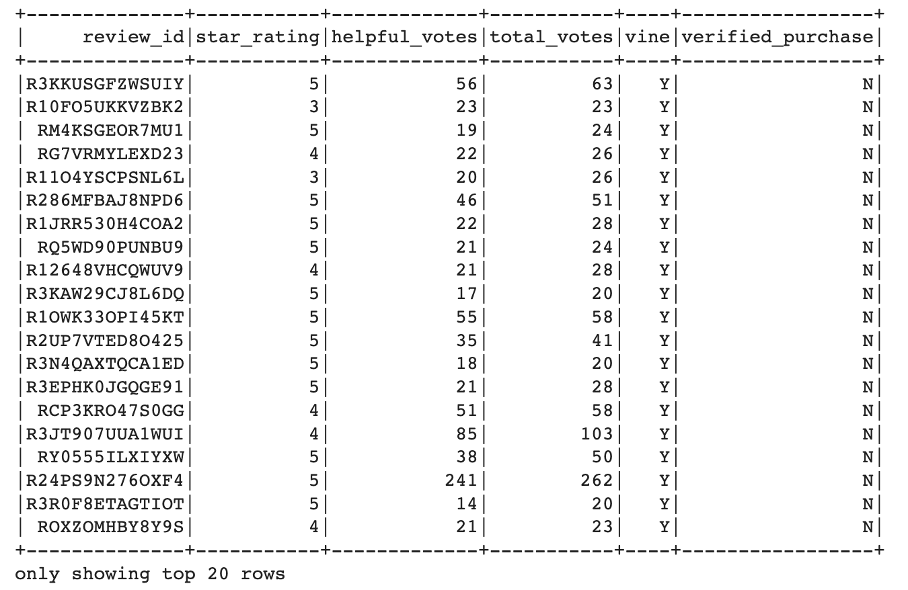
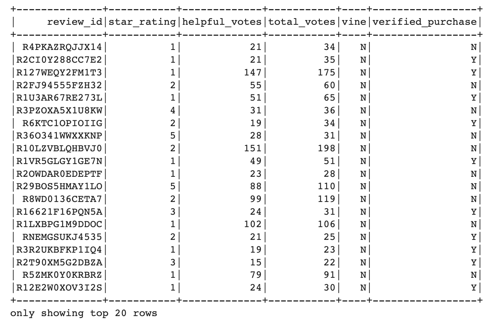
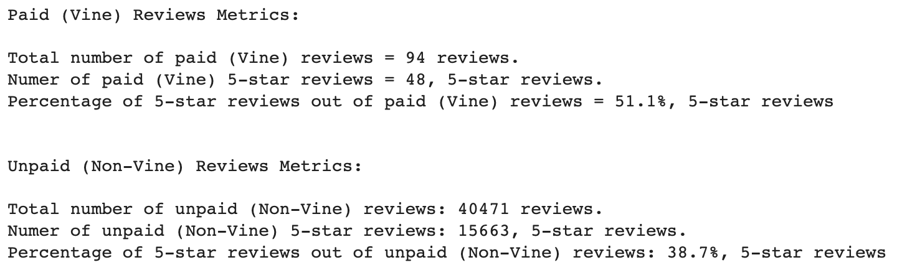

# Amazon_Vine_Analysis

## Overview

This analysis focuses on the Amazon Vine program; assessing favorability bias between reviews written by Vine members and non-Vine members. The Amazon Vine program is a service that allows manufacturers and publishers to receive reviews for their products. Companies selling products on Amazon can pay a small fee to Amazon and provide products to Amazon Vine members, who are then required to publish a review.

Our chosen Amazon Reviews dataset contains reviews (Vine and non-Vine) within the Video Games product category. Using PySpark we have extracted the reviews dataset, transformed the data to match our database schema, and connected to the AWS-RDS hosted database to load the data tables to the PostgreSQL database. Pyspark was again used for the analysis to obtain metrics that will help determine if there is any bias toward favorable reviews from Vine members in the reviews dataset for the Video Games product category. 

## Results

### Final Pyspark Dataframes Used for Analysis

The reviews dataset was filtered to only include columns of information relevant to our analysis of Vine reviews. The Vine reviews dataframe was further filtered, on the rows level, for reviews with at least 20 total votes (total helpful or unhelpful votes), and where helpful votes were at least 50% of the total votes. Then the resulting dataframe was split into 2 dataframes, one for Vine reviews and one for Non-Vine reviews. Below is the first 20 rows of the 2 final dataframes used for analysis. 

- Vine Reviews Dataframe

- Non-Vine Reviews Dataframe

### Obtained Metrics Using Pyspark

Below, the output for retrieving necessary metrics from the dataframes using Pyspark is displayed.

- Metrics: Pyspark Output

### Video Games Vine Reviews - Results Breakdown
- Total Number of Reviews for Vine and Non-Vine Reviews
    - There are a total of *94* Vine reviews.
    - There are a total of *40,471* Non-Vine reviews.
- Number of 5-star Reviews for Vine and Non-Vine Reviews 
    - There are *48* Vine 5-star reviews.
    - There are *15,663* Non-Vine 5-star reviews.
- Percentage of 5-Star Reviews for Vine and Non-Vine Reviews
    - *51.1%* of Vine reviews gave a 5-star rating.
    - *38.7%* of Non-Vine reviews gave a 5-star rating.

## Summary

<!-- Summary: In your summary, state if there is any positivity bias for reviews in the Vine program. Use the results of your analysis to support your statement. Then, provide one additional analysis that you could do with the dataset to support your statement. -->

By simply examining the raw metrics calculated in our results, we can see that there may be an association between favorable 5-star ratings and the reviews being given by Vine members. Slightly more than half of the reviews given by Vine members were 5-star ratings, meanwhile less than 40% of reviews given by Non-Vine members were 5-star ratings. While this conclusion can be inferred by comparing the these raw metrics at face-value, further statistical analysis may be required to test the statistical significance of these findings. 

It should be noted that there is a large difference in the sample sizes between the two classes in our comparison (Vine reviews and Non-Vine reviews). There were over 40,000 Non-Vine reviews, while there were less than 100 Vine reviews to compare in our dataset. For additional analysis, we may want to include statstical testing to determine the probability of favorable 5-star rating reviews belonging to either Vine members or Non-Vine members. We must find this probability of occurence or the strength of the relationships between each class and favorable 5-star ratings by using statistical testing methods that account for our uneven sample sizes (or are otherwise agnostic of sample size differences). Once we perform this additional analysis, we may be able to, more confidently, conclude, whether or not, favorability bias exists for Vine reviews, as this will help us quantiify the statistical significance of our results and account for sample sizes.